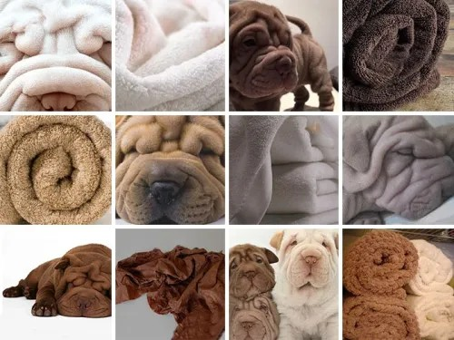
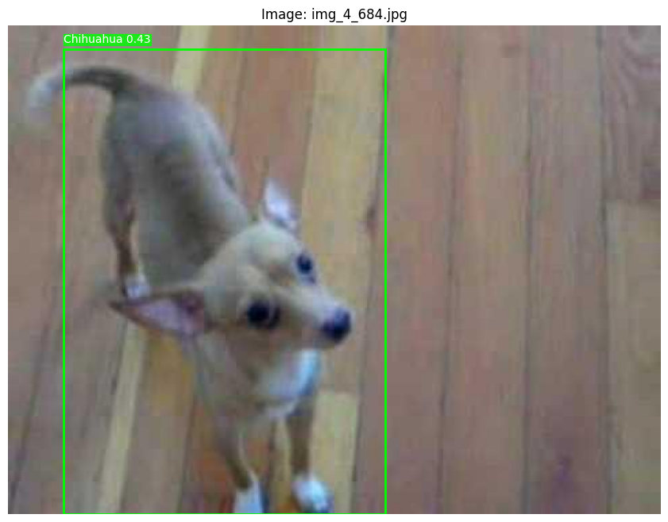
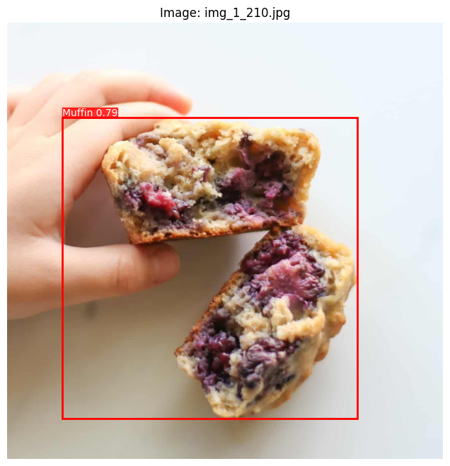
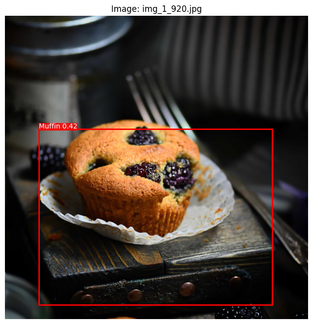

#   Лабораторная работы №4 по дисциплине "Системы копьютерного зрения"
# Обучение модели для классификация изображений

**Задача:** Разработка системы классификации изображений для различения двух классов объектов (в данной работе - чихуахуа и маффинов) с применением современных методов компьютерного зрения.  

### Цель работы  
&ensp; &ensp; Создать end-to-end решение для классификации изображений на два класса, используя предобученную модель, аугментации данных и методы обработки bounding box'ов. Работа включает подготовку датасета, обучение модели, оценку качества и визуализацию результатов.  

### Задания:  
1. **Подготовка данных** — автоматическая загрузка датасета с Kaggle, фильтрация некорректных изображений, генерация аннотаций в формате YOLO.  
2. **Аугментация данных** — применение геометрических трансформаций, изменения яркости и размытия для увеличения разнообразия тренировочных данных.  
3. **Обучение модели** — дообучение YOLOv8 на подготовленном датасете с настройкой гиперпараметров.  
4. **Оценка качества** — расчет метрик (mAP, Precision, Recall, ROC AUC) и визуализация результатов (ROC-кривая, матрица ошибок).  
5. **Интерпретация результатов** — объединение пересекающихся bounding box'ов и детализированный вывод данных о распознанных объектах.  

---

## Предыстория датасета  

### **1. Происхождение мема (2016 г.)**  
&ensp; &ensp; Волну интереса к визуальной двусмысленности между чихуахуа и маффинами начинаются в 2016 году, когда в соцсетях начали распространяться коллажи с изображениями миниатюрных собак и сладкой выпечки. Пользователи отмечали их удивительное сходство: округлые формы, коричневатые оттенки и текстура поверхности (например, шерсть чихуахуа и крошки маффина) провоцировали когнитивный диссонанс. Мем быстро стал виральным, превратившись в метафору сложности распознавания объектов для ИИ.  

---

### **2. Переход к технологическим экспериментам (2017–2018 гг.)**  
&ensp; &ensp; В 2017 году разработчики и исследователи, включая Марию Яо и команду Metamaven, использовали мем как основу для тестирования API компьютерного зрения (Google Vision API, Amazon Rekognition). Эксперименты показали, что даже продвинутые системы часто ошибались:  
- **Google Vision API** классифицировал изображение маффина как «щенка» с вероятностью 80%.  
- Аналогичные проблемы возникали с другими моделями, что подчеркивало зависимость алгоритмов от текстур и форм, а не глубокого контекста.  

Это стало отправной точкой для дискуссий о «слепоте» ИИ к семантике и важности датасетов, имитирующих реальные условия.  

---

### **3. Создание датасета и образовательные проекты (2019–2020 гг.)**  
В 2019 году исследователь **Кристиан Дюге** (Christian Dugue) систематизировал идею, создав открытый датасет «Muffin vs. Chihuahua» для обучения моделей. Его проект включал:  
- **Более 1000 изображений** собак и выпечки, включая вариации освещения, ракурсов и фонов.  
- Примеры кода на PyTorch и fast.ai для обучения нейросетей.  

Датасет стал популярным инструментом в образовательных курсах по машинному обучению, иллюстрируя проблемы переобучения и важность аугментации данных.  

---

### **4. Расширение темы**
&ensp; &ensp; Мем «Muffin or Chihuahua» стал отправной точкой для целой серии визуальных задач, где границы между объектами стираются из-за схожих паттернов. Такие примеры, как **«Sheepdog or Mop»** (овчарка или швабра), **«Labradoodle or Fried Chicken»** (лабрадудель или жареная курица) и **«Shar-Pei or Towel»** (шарпей или полотенце), демонстрируют, как текстуры, формы и цвета могут вводить в заблуждение не только людей, но и алгоритмы. 

&ensp; &ensp; Эти кейсы подчеркивают ключевую проблему компьютерного зрения: зависимость моделей от локальных признаков вместо понимания контекста. Например, кудрявая шерсть овчарки может быть спутана с волнистыми волокнами швабры, а морщины шарпея — с складками махрового полотенца. Такие аналогии стали основой для новых датасетов и экспериментов, направленных на улучшение интерпретации сложных визуальных сцен, доказывая, что даже абсурдные на первый взгляд сравнения способны раскрыть глубинные недостатки ИИ-систем

---

### **5. Научная валидация и мультимодальные исследования (2021–2024 гг.)**  
К 2024 году датасет стал объектом серьезных исследований:  
- В статье на **arXiv (2401.15847)** его использовали для тестирования мультимодальных моделей (например, CLIP), которые анализируют связь изображений и текста.  
- Ученые изучали, как системы справляются с «шумом»: например, маффины с глазками-конфетами или чихуахуа в костюмах.  
- Датасет помог выявить, что современные ИИ всё ещё путают объекты в 15–20% случаев, если отсутствует контекст (например, фон или дополнительные детали).  

---

*Ссылки на связанные материалы:*

**[Chihuahua or muffin? My search for the best computer vision API](https://www.freecodecamp.org/news/chihuahua-or-muffin-my-search-for-the-best-computer-vision-api-cbda4d6b425d/)**

**[Muffin or Chihuahua: Confusion Matrix and the Base Rate Fallacy](https://neurabites.com/muffin-or-chihuahua/)**

---

## Используемая модель YOLO (You Only Look Once)

&ensp; &ensp; YOLO (You Only Look Once) представляет собой семейство алгоритмов для обнаружения объектов в реальном времени, сочетающих высокую скорость и точность. Основанная на одностадийном подходе, эта модель преобразует задачу обнаружения в регрессионную проблему, разделяя входное изображение на сетку ячеек, каждая из которых отвечает за предсказание ограничивающих рамок (bounding boxes), уровня уверенности (confidence score) и вероятностей принадлежности к классам. Такой метод обеспечивает обработку изображений за один проход, что гарантирует скорость до 100 кадров в секунду, что критически важно для приложений реального времени.  

#### **Архитектура YOLO** включает три ключевых компонента:  
1. **Backbone** (например, CSPDarknet в YOLOv5/v8) для извлечения признаков.  
2. **Neck** (такие структуры, как PANet или FPN), агрегирующий признаки различных масштабов.  
3. **Head**, ответственный за финальные предсказания.  
Новейшие версии, такие как **YOLOv12**, внедряют инновации, включая **региональный механизм внимания (Area Attention)**, который делит карты признаков на зоны для снижения вычислительной нагрузки, и **R-ELAN** — оптимизированную структуру для эффективной передачи информации между слоями.  

#### **Функция потерь** 
&ensp; &ensp; Функция потерь в YOLO комбинирует локализационную ошибку (MSE для координат рамок), ошибку уверенности (MSE) и ошибку классификации (кросс-энтропия). В более поздних версиях, начиная с YOLOv2, добавлены anchor boxes для улучшения обнаружения объектов разных размеров, а в YOLOv5/v8 — Focal Loss для борьбы с дисбалансом классов. YOLOv12 дополнительно оптимизирует процесс за счет регионального внимания, повышая точность локализации, особенно для мелких объектов.  

#### **Преимущества YOLO** 
&ensp; &ensp; Преимущества включают высокую скорость обработки, контекстный анализ всего изображения, снижающий риск ложных срабатываний, и адаптивность к различным задачам. Новейшие версии, такие как YOLOv12, демонстрируют значительный прогресс в обнаружении мелких объектов (например, дефектов в промышленности или плодов в сельском хозяйстве) и используют синтетические данные, сгенерированные с помощью языковых моделей, для повышения робастности.  

#### **Недостатки** 
&ensp; &ensp; Недостатки включают исторически ограниченную точность при обнаружении мелких объектов (хотя YOLOv12 значительно улучшил этот аспект), фиксированное количество предсказаний на ячейку и необходимость тонкой настройки гиперпараметров.  

#### **Эволюция версий**:  
- **YOLOv1 (2016)**: Базовая архитектура без anchor boxes.  
- **YOLOv3 (2018)**: Мультимасштабное предсказание и интеграция FPN.  
- **YOLOv5 (2020)**: Оптимизация для мобильных устройств с версиями от nano до xlarge.  
- **YOLOv12 (2024)**: Региональное внимание, R-ELAN, снижение вычислительной сложности.  

#### Сравнение новейших версий YOLO

&ensp; &ensp; Сравнение тепловых карт между YOLOv10, YOLOv11 и предложенной YOLOv12. По сравнению с усовершенствованными YOLOv10 и YOLOv11, YOLOv12 демонстрирует более четкое восприятие объектов на изображении. Все результаты получены с использованием моделей в масштабе X:

Сравнение с популярными методами с точки зрения компромисса между задержкой и точностью (слева) и точностью FLOPs (справа):

#### **Применение YOLO** 
&ensp; &ensp; YOLO охватывает автономные транспортные системы (распознавание пешеходов и дорожных знаков), промышленность (контроль качества), сельское хозяйство (автоматизированная уборка урожая), медицину (анализ рентгеновских снимков) и робототехнику.  

#### **Сравнение с другими моделями**:  
- **Faster R-CNN** превосходит YOLO по точности, но уступает в скорости.  
- **SSD** имеет схожую скорость, но хуже обрабатывает мелкие объекты.  
- **YOLOv12** демонстрирует оптимальный баланс скорости и точности благодаря интеграции механизмов внимания.  

#### **Итог** 
&ensp; &ensp; YOLO революционизировал компьютерное зрение, предложив одностадийный подход к обнаружению объектов. Новейшие версии, такие как YOLOv12, устраняют исторические ограничения за счет инноваций в архитектуре и алгоритмах, сохраняя при этом высокую производительность. Это делает YOLO незаменимым инструментом для задач, где критически важны скорость и точность, включая реальное время и промышленные приложения.

## Описание работы   

### Подготовка данных  

**[Ссылка на датасет](https://www.kaggle.com/datasets/samuelcortinhas/muffin-vs-chihuahua-image-classification)** взятый на сайте kaggle.

&ensp; &ensp; Для работы используется датасет `muffin-vs-chihuahua`, загружаемый через функцию `setup_kaggle_dataset()`. Эта функция автоматически скачивает данные с платформы Kaggle, проверяет их целостность и организует в структуру с тренировочными и тестовыми поддиректориями для каждого класса. Если данные уже существуют, функция позволяет перезаписать их с помощью флага `force_copy`.  

**Генерация аннотаций** выполняется в два этапа:  
1. **Выделение крупных объектов** — функция `find_largest_object()` анализирует изображение с помощью гауссова размытия, адаптивной бинаризации и морфологических операций для выделения доминирующего объекта. Результатом является bounding box в формате YOLO (нормированные координаты центра, ширина и высота).  
2. **Фильтрация bounding box'ов** — функция `filter_bboxes()` оставляет только самый большой объект, игнорируя мелкие артефакты. Это обеспечивает чистоту аннотаций и повышает точность обучения.

&ensp; Для проверки сгенерированных аннотаций была использована функция `visualize_random_images` в которой из всей выборки размеченных изображений берут по 3 изображения каждого класса. Вывод информации по этой функции выглядит следующим образом:

&ensp; Однако многие не смотря на сипользования одних из лучших методов нахождения объектов, алгоритм размечает самый большой объект неидеально:

---

### Аугментация данных  
&ensp; &ensp; Для увеличения разнообразия тренировочных данных применяется пайплайн аугментаций, создаваемый функцией `create_augmentation_pipeline()`. Он включает горизонтальные и вертикальные отражения (с вероятностью 40% и 30%), случайные повороты (±20°), изменение яркости/контраста, размытие и масштабирование. Для каждого изображения генерируется 4 аугментированные копии, что увеличивает размер тренировочной выборки и снижает риск переобучения.  

---

### Обучение модели  
&ensp; Модель YOLOv12 дообучается на подготовленном датасете с использованием конфигурации:  
- Размер входного изображения: 640x640,  
- Размер батча: 64,  
- Количество эпох: 20.  
Обучение проводится как на оригинальных, так и на аугментированных данных. Результаты сохраняются в отдельную директорию, включая веса модели и логи обучения.  

---

### Оценка качества  
&ensp; Качество модели оценивается с помощью функции `evaluate_model()`, которая рассчитывает метрики:  
- **mAP@0.5 и mAP@0.5:0.95** — средняя точность при разных порогах Intersection over Union (IoU),  
- **Precision и Recall** — баланс между точностью и полнотой,  
- **ROC AUC** — площадь под ROC-кривой для бинарной классификации.  
&ensp; Результаты визуализируются с помощью:  
- **ROC-кривой**,  
- **Матрицы ошибок**,  
- **Precision-Recall кривой**.  

Модель показывает приемлиемые показатели качества, что достаточно для начала тестирования на сторонних изображений.

Метрика качества F1-score и карта местоположений классов на обучаемой выборке, встроенные в YOLOv12:

---

### Применение модели  
&ensp; После обучения модель используется для классификации новых изображений через функцию `classify_with_saved_weights()`. Она выполняет:  
1. **Детекцию объектов** с фильтрацией по порогу уверенности (`conf_threshold=0.3`),  
2. **Объединение пересекающихся bounding box'ов** (функция `merge_boxes()`) на основе IoU (порог 0.5),  
3. Визуализацию:  
   - Исходное изображение с bounding box'ами,  
   - Уверенность модели и метки классов,  
   - Подробные данные о размерах объектов.  

#### Применение модели для случайной тестовой выборки из датасета

В целом алгоритм в большей степени справляется с распознаванием классов и выдает правильный результат

  

  

Однако в некоторых случаях распознать объект не получается, либо это происходит не в полной мере:

Конкретно в данном случае это может быть связанно с тем чт само изображение имеет необычно большое разрешение из-за чего класс не может быть определен

Здесь же алгоритм обозначил только один центральный объект.

#### Применение модели для изображений не из датасета

Алгоритм в большей степени справляется с распознаванием классов среди изображений не находящихся в датасете и выдает правильный результат

  

  

В подборке из 16 изображений на одном из изображении модель смогла распознать только заднюю часть чихуа хуа, что говорит об неидеальности распознавания объектов на сложных изображениях с большим разрешением:

#### Применение модели для изображений из мема

В подборке из 16 изображений с плохим качеством из одноименного мема, модель показала что смогла отличить чихуахуа и маффин в 14 из 16 случаев. Модель ошиблась в двух случаях и вместо маффина распознала чихуахуа, что не удивительно, ведь они имеют очень схожие черты, характерные маленьким желтым собачкам с черными глазками и черным носиком.

#### Применение модели в выборке YOLOv12

Классификация и детекция объектов в проверочной (валидационной) выборке, встроенной в YOLOv12:

---

### Заключение  
&ensp; &ensp; Решение демонстрирует достаточную эффективность классификации за счет использования YOLOv12 для детекции объектов. В работе были применены такие методы как аугментация, повышающая обобщающую способность модели, а также фильтрация и объединение bounding box'ов для устранения ложных срабатываний.  
